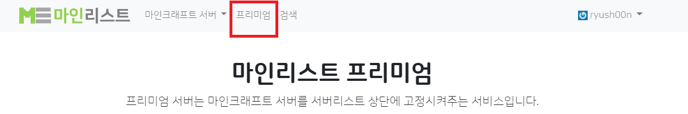

# 캠페인 구매

### 프리미엄 페이지 접속

마인리스트 상단의 프리미엄을 누르면 프리미엄 페이지에 접속됩니다

<figure><figcaption></figcaption></figure>

### 1. 기본 정보 선택

캠페인(광고 기간)과 광고할 서버를 선택해 주세요.

<figure><figcaption></figcaption></figure>


서버가 뜨지 않는 경우 서버 관리자로 인증된 상태인지 확인해 주세요.


### 2. 광고 선택

구매할 광고 게시 공간을 선택해 주세요. 일반적으로 시간이 흐를수록 저렴한 광고를 구매할 수 있지만, 그 사이 다른 사람이 광고 게시 공간을 구매할 수도 있으니 주의하세요.

<figure><figcaption></figcaption></figure>

### 3. 안내 사항 확인

안내 사항을 확인합니다. 구매 시 필수적인 내용과 청약 철회 등에 관한 내용이 있으니 잘 살펴보시기 바랍니다.

### 4. 구매 확인

최종적으로 구매가 진행되기 전 구매 내용이 맞는지 확인하는 단계입니다. 빨간색 글씨로 표시된 내용이 있는 경우 빠뜨린 내용이 있을 수 있으니 위에 입력한 내용들을 검토해주세요.

결제 방법을 선택하고, 내용을 확인한 후 체크박스를 체크한 후 결제 진행 버튼을 눌러 결제를 시작할 수 있습니다.

<figure><figcaption></figcaption></figure>

